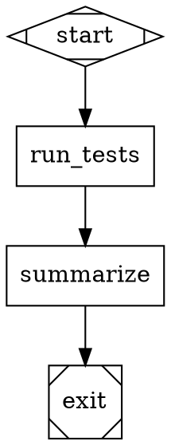

# Kilroy

Kilroy is a local-first CLI for running StrongDM-style Attractor pipelines in a git repo.

High-level flow:

1. Convert English requirements to a Graphviz DOT pipeline (`attractor ingest`).
2. Validate graph structure and semantics (`attractor validate`).
3. Execute node-by-node with coding agents in an isolated git worktree (`attractor run`).
4. Resume interrupted runs from logs, CXDB, or run branch (`attractor resume`).

## Installation

### Homebrew (macOS and Linux)

```bash
brew tap danshapiro/kilroy
brew install kilroy
```

### Go Install

```bash
go install github.com/danshapiro/kilroy/cmd/kilroy@latest
```

### Build from Source

```bash
go build -o kilroy ./cmd/kilroy
```

## What Is CXDB?

CXDB is the execution database Kilroy uses for observability and recovery.

- Kilroy records typed run events (run started, stage finished, checkpoint saved, run completed/failed) to CXDB.
- Kilroy stores artifacts (logs, outputs, archives) in CXDB blobs.
- Resume-from-CXDB works because run metadata (like `logs_root` and checkpoint pointers) is written into this timeline.

Short version: git branch is code history; CXDB is run history.

## What Attractor Means Here

An Attractor pipeline is a `digraph` where:

- Nodes are stages (`start`, `exit`, codergen tasks, conditionals, human gates, tool steps, parallel/fan-in).
- Edges define control flow and optional conditions/retry behavior.
- The engine checkpoints after each stage and routes to the next stage deterministically.

In this repo, each completed node also creates a git checkpoint commit on a run branch.

## StrongDM Attractor vs Kilroy Implementation

This implementation is based on the Attractor specification by StrongDM at `https://github.com/strongdm/attractor`. Here's how Kilroy differs

| Area | From StrongDM Attractor Specs | Kilroy-Specific in This Repo |
|---|---|---|
| Graph DSL + engine semantics | DOT schema, handler model, edge selection, retry, conditions, context fidelity | Concrete Go engine implementation details and defaults |
| Coding-agent loop | Session model, tool loop behavior, provider-aligned tool concepts | Local tool execution wiring and CLI/API backend routing choices |
| Unified LLM model | Provider-neutral request/response/tool/streaming contracts | Concrete provider adapters and environment wiring |
| Provider support | Conceptual provider abstraction | Provider plug-in runtime with built-ins: OpenAI, Anthropic, Google, Kimi, ZAI, Minimax |
| Backend selection | Spec allows flexible backend choices | Backend is mandatory per provider (`api`/`cli`), no implicit defaults |
| Checkpointing + persistence | Attractor/CXDB contracts | Required git branch/worktree/commit-per-node and concrete artifact layout |
| Ingestion | Ingestor behavior described in spec docs | `attractor ingest` implementation: Claude CLI + `create-dotfile` skill |

## Prerequisites

- Go 1.25+
- Git repo with at least one commit
- Clean working tree before `attractor run`/`resume`
- CXDB reachable over binary + HTTP endpoints (or configure `cxdb.autostart`)
- Provider access for any provider used in your graph
- `claude` CLI for `attractor ingest` (or set `KILROY_CLAUDE_PATH`)

## Quickstart

### 1) Build

```bash
go build -o kilroy ./cmd/kilroy
```

### 2) Generate a pipeline from English

```bash
./kilroy attractor ingest -o pipeline.dot "Solitaire plz"
```

Notes:

- Ingest auto-detects `skills/create-dotfile/SKILL.md` from `--repo` (default: cwd), then falls back to paths relative to the `kilroy` binary (including Homebrew-style `../share/kilroy/skills/...`) and Go module-cache install roots from build metadata (`go install`).
- Use `--skill <path>` if your skill file is elsewhere.

### 3) Validate the pipeline

```bash
./kilroy attractor validate --graph pipeline.dot
```

If you want to author a graph manually instead of using `ingest`, this minimal example is valid:



### 4) Create `run.yaml`

```yaml
version: 1

repo:
  path: /absolute/path/to/target/repo

cxdb:
  binary_addr: 127.0.0.1:9009
  http_base_url: http://127.0.0.1:9010
  autostart:
    enabled: true
    # argv form; use an absolute path if you run kilroy outside repo root.
    command: ["/absolute/path/to/kilroy/scripts/start-cxdb.sh"]
    wait_timeout_ms: 20000
    poll_interval_ms: 250
    ui:
      enabled: true
      command: ["/absolute/path/to/kilroy/scripts/start-cxdb-ui.sh"]
      url: "http://127.0.0.1:9020"

llm:
  cli_profile: real
  providers:
    openai:
      backend: cli
    anthropic:
      backend: api
    google:
      backend: api
    kimi:
      backend: api
      api:
        protocol: anthropic_messages
        api_key_env: KIMI_API_KEY
        base_url: https://api.kimi.com/coding
        path: /v1/messages
        profile_family: openai
    zai:
      backend: api
      api:
        protocol: openai_chat_completions
        api_key_env: ZAI_API_KEY
        base_url: https://api.z.ai
        path: /api/coding/paas/v4/chat/completions
        profile_family: openai

modeldb:
  openrouter_model_info_path: /absolute/path/to/kilroy/internal/attractor/modeldb/pinned/openrouter_models.json
  openrouter_model_info_update_policy: on_run_start
  openrouter_model_info_url: https://openrouter.ai/api/v1/models
  openrouter_model_info_fetch_timeout_ms: 5000

git:
  require_clean: false
  run_branch_prefix: attractor/run
  commit_per_node: true

runtime_policy:
  stage_timeout_ms: 0
  stall_timeout_ms: 600000
  stall_check_interval_ms: 5000
  max_llm_retries: 6

preflight:
  prompt_probes:
    enabled: true
    transports: [complete, stream]
    timeout_ms: 15000
    retries: 1
    base_delay_ms: 500
    max_delay_ms: 5000
```

Important:

- Any provider referenced by a node's `llm_provider` must have `llm.providers.<provider>.backend` configured.
- `cxdb.binary_addr`, `cxdb.http_base_url`, and `modeldb.openrouter_model_info_path` are required.
- Deprecated compatibility: `modeldb.litellm_catalog_*` keys are still accepted for one release.
- Config can be YAML or JSON.

### 5) Run the pipeline

Real run (recommended/default profile):

```bash
unset KILROY_CODEX_PATH KILROY_CLAUDE_PATH KILROY_GEMINI_PATH
./kilroy attractor run --graph pipeline.dot --config run.yaml
```

Explicit test-shim run (for local fake-provider testing only):

```yaml
llm:
  cli_profile: test_shim
  providers:
    openai:
      backend: cli
      executable: /absolute/path/to/fake-codex
```

```bash
./kilroy attractor run --graph pipeline.dot --config run.yaml --allow-test-shim
```

Preflight-only run (validate everything, do not start execution):

```bash
./kilroy attractor run --graph pipeline.dot --config run.yaml --preflight
./kilroy attractor run --graph pipeline.dot --config run.yaml --test-run
```

Preflight-only mode contract:

- `--test-run` is an alias of `--preflight`.
- It still enforces normal startup safety gates (stale-build confirmation, CLI headless warning, `--allow-test-shim` policy, provider/model preflight, CXDB readiness unless `--no-cxdb`).
- It writes `{logs_root}/preflight_report.json`.
- It does not start traversal or stage execution.
- These are absent by design: `final.json`, `checkpoint.json`, `manifest.json`, `run.pid`, `worktree/`, run branch traversal.

On success, stdout includes:

- `run_id=...`
- `logs_root=...`
- `worktree=...`
- `run_branch=...`
- `final_commit=...`
- `cxdb_ui=...` (when `cxdb.autostart.ui.url` is configured)

If autostart is used, startup logs are written under `{logs_root}`:

- `cxdb-autostart.log`
- `cxdb-ui-autostart.log`

Observe and intervene during long runs:

```bash
./kilroy attractor status --logs-root <logs_root>
./kilroy attractor stop --logs-root <logs_root> --grace-ms 30000 --force
```

For long pipelines that re-enter nodes (e.g. `postmortem` → `impl_fanout`), pass `--no-stage-archive-stacking` to prevent exponential disk growth in `stage.tgz` archives — see the [Commands](#commands) section for details.

## CXDB Autostart Notes

- `cxdb.autostart.command` is required when `cxdb.autostart.enabled=true`.
- This repo includes `scripts/start-cxdb.sh` and `scripts/start-cxdb-ui.sh` launchers for local Docker-based CXDB.
- `scripts/start-cxdb.sh` is idempotent: it reuses a healthy instance and starts one if missing.
- By default `scripts/start-cxdb.sh` requires the named Docker container to avoid silently using a test shim on the same ports.
- `cxdb.autostart.ui.url` is optional; when omitted, Kilroy auto-detects it from `cxdb.http_base_url` if that endpoint serves HTML UI.
- `cxdb.autostart.ui.command` is optional; Kilroy starts UI when a command is provided (config or `KILROY_CXDB_UI_COMMAND`).
- Kilroy injects these env vars for autostart commands:
  - `KILROY_RUN_ID`
  - `KILROY_CXDB_HTTP_BASE_URL`
  - `KILROY_CXDB_BINARY_ADDR`
  - `KILROY_LOGS_ROOT`
  - `KILROY_CXDB_UI_URL` (UI command only)
- You can also set:
  - `KILROY_CXDB_UI_URL` to force the printed UI link.
  - `KILROY_CXDB_UI_COMMAND` as a shell command used to start UI by default.
  - `KILROY_CXDB_ALLOW_EXTERNAL=1` to let `scripts/start-cxdb.sh` accept a pre-existing non-docker CXDB endpoint.
- If CXDB is unreachable and autostart is disabled, Kilroy fails fast with a remediation hint.

## Provider Setup

Provider runtime architecture:

- Providers are protocol-driven and configured under `llm.providers.<provider>`.
- Built-ins include `openai`, `anthropic`, `google`, `kimi`, `zai`, `cerebras`, and `minimax`.
- Provider aliases: `gemini`/`google_ai_studio` -> `google`, `moonshot`/`moonshotai` -> `kimi`, `z-ai`/`z.ai` -> `zai`, `cerebras-ai` -> `cerebras`, `minimax-ai` -> `minimax`.
- CLI contracts are built-in for `openai`, `anthropic`, and `google`.
- `kimi`, `zai`, `cerebras`, and `minimax` are API-only in this release.
- `profile_family` selects agent behavior/tooling profile only; API requests still route by `llm_provider` (native provider key).

CLI backend command mappings:

- `openai` -> `codex exec --json --sandbox workspace-write ...`
- `anthropic` -> `claude -p --output-format stream-json ...`
- `google` -> `gemini -p --output-format stream-json --yolo ...`

Execution policy:

- `llm.cli_profile` defaults to `real`.
- In `real`, Kilroy uses canonical binaries (`codex`, `claude`, `gemini`) and rejects `KILROY_CODEX_PATH`, `KILROY_CLAUDE_PATH`, `KILROY_GEMINI_PATH`.
- For fake/shim binaries, set `llm.cli_profile: test_shim`, configure `llm.providers.<provider>.executable`, and run with `--allow-test-shim`.

API backend environment variables:

- OpenAI: `OPENAI_API_KEY` (`OPENAI_BASE_URL` optional)
- Anthropic: `ANTHROPIC_API_KEY` (`ANTHROPIC_BASE_URL` optional)
- Google: `GEMINI_API_KEY` or `GOOGLE_API_KEY` (`GEMINI_BASE_URL` optional)
- Kimi (Coding API key): `KIMI_API_KEY`
- ZAI: `ZAI_API_KEY`
- Cerebras: `CEREBRAS_API_KEY`
- Minimax: `MINIMAX_API_KEY` (`MINIMAX_BASE_URL` optional)

API prompt-probe tuning (preflight):

- `KILROY_PREFLIGHT_API_PROMPT_PROBE_TIMEOUT_MS` (default `30000`)
- `KILROY_PREFLIGHT_API_PROMPT_PROBE_RETRIES` (default `2`, retries only transient failures)
- `KILROY_PREFLIGHT_API_PROMPT_PROBE_BASE_DELAY_MS` (default `500`)
- `KILROY_PREFLIGHT_API_PROMPT_PROBE_MAX_DELAY_MS` (default `5000`)

Run config policy takes precedence over env tuning:

- `runtime_policy.*` controls stage timeout, stall watchdog, and LLM retry cap.
- `preflight.prompt_probes.*` controls prompt-probe enablement, transports, and probe policy.

Kimi compatibility note:

- Built-in `kimi` defaults target Kimi Coding (`anthropic_messages`, `https://api.kimi.com/coding`).
- If you use Moonshot Open Platform keys instead, override `kimi.api` to `protocol: openai_chat_completions`, `base_url: https://api.moonshot.ai`, `path: /v1/chat/completions`.

## Node Attributes

Node attributes are DOT key=value pairs on `[shape=box]` nodes that control engine behaviour.

### Output token limit (`max_tokens`)

Every provider adapter has a built-in default output token cap of **32768** tokens. This is the
per-response limit — how many tokens the model may generate in a single API call. It is completely
separate from the model's input context window.

Override it per-node with `max_tokens`:

```dot
implement [
  shape=box,
  max_agent_turns=300,
  max_tokens=32768,        // default; increase for very large file writes
  prompt="..."
]
```

**Why this matters:** If `max_tokens` is too small the model will silently hit the cap mid-generation
(especially during large `write_file` tool calls), return an empty or truncated response, and Kilroy
will interpret the session as cleanly ended. For nodes that write large files (full source modules,
extensive spec documents), keep `max_tokens` at 32768 or higher.

Provider-specific behaviour:

| Provider  | When `max_tokens` omitted | Notes |
|-----------|---------------------------|-------|
| Google (Gemini) | 32768 | Always sent; Google API requires the field |
| Anthropic | 32768 | Always sent; Anthropic API requires the field |
| OpenAI (Responses) | omitted (API uses model default) | Only sent when explicitly set |
| OpenAI-compat | omitted (API uses model default) | Only sent when explicitly set |
| Kimi | max(32768, 16000) | 16000 minimum enforced by provider policy |

### Turn budget (`max_agent_turns`)

Caps the number of agent turns (model calls) in a single session. Defaults to unlimited.

```dot
implement [shape=box, max_agent_turns=300, prompt="..."]
```

### Reasoning effort (`reasoning_effort`)

Passed to the model as the reasoning effort parameter where supported (e.g. `low|medium|high` for
Anthropic extended thinking, `o1`-family models).

```dot
review [shape=box, reasoning_effort=high, prompt="..."]
```

## Run Artifacts

Typical run-level artifacts under `{logs_root}`:

- `graph.dot`
- `preflight_report.json`
- `manifest.json`
- `checkpoint.json`
- `final.json`
- `run_config.json`
- `modeldb/openrouter_models.json`
- `run.tgz` (run archive excluding `worktree/`)
- `worktree/` (isolated execution worktree)

Typical stage-level artifacts under `{logs_root}/{node_id}`:

- `prompt.md`
- `response.md`
- `status.json`
- `stage.tgz`
- CLI backend extras: `cli_invocation.json`, `stdout.log`, `stderr.log`, `events.ndjson`, `events.json`, `output_schema.json`, `output.json`
- API backend extras: `api_request.json`, `api_response.json`, `events.ndjson`, `events.json`

## Commands

```text
kilroy attractor run [--preflight|--test-run] [--allow-test-shim] [--force-model <provider=model>] [--no-stage-archive-stacking] --graph <file.dot> --config <run.yaml> [--run-id <id>] [--logs-root <dir>]
kilroy attractor resume --logs-root <dir> [--no-stage-archive-stacking]
kilroy attractor resume --cxdb <http_base_url> --context-id <id>
kilroy attractor resume --run-branch <attractor/run/...> [--repo <path>]
kilroy attractor status --logs-root <dir> [--json]
kilroy attractor stop --logs-root <dir> [--grace-ms <ms>] [--force]
kilroy attractor validate --graph <file.dot>
kilroy attractor ingest [--output <file.dot>] [--model <model>] [--skill <skill.md>] <requirements>
kilroy attractor serve [--addr <host:port>]
```

`--force-model` can be passed multiple times (for example, `--force-model openai=gpt-5.4 --force-model google=gemini-3-pro-preview`) to override node model selection by provider.
Supported providers are `openai`, `anthropic`, `google`, `kimi`, `zai`, and `minimax` (aliases accepted).

`--no-stage-archive-stacking` excludes nested `visit_*/stage.tgz` files from the per-stage `stage.tgz` archive. Without this flag, when a node is re-entered N times (for example via `postmortem` → `impl_fanout` loops), each new visit's archive transitively includes every prior visit's archive, doubling in size per visit and producing exponential disk growth (issue #89). All per-visit metadata files (`response.md`, `status.json`, `prompt.md`, `events.{json,ndjson}`, `stdout.log`, etc.) are still archived — only the redundant inner tarballs are dropped. Recommended for any long-running pipeline that may revisit nodes. Available on both `attractor run` and `attractor resume --logs-root`.

Additional ingest flags:

- `--repo <path>`: repo root to run ingestion from (default: cwd)
- `--no-validate`: skip post-generation DOT validation

Exit codes:

- `0`: run/resume finished with final status `success`, or validate succeeded
- `1`: command failed, validation error, or final status was not `success`

## HTTP Server Mode (Experimental)

**This feature is experimental and subject to breaking changes.**

`kilroy attractor serve` starts an HTTP server that exposes pipeline management via a REST API with Server-Sent Events (SSE) for real-time progress streaming. This enables remote pipeline submission, live observability dashboards, and web-based human-in-the-loop gates.

```bash
kilroy attractor serve                    # listens on 127.0.0.1:8080
kilroy attractor serve --addr :9090       # custom address
```

Endpoints:

| Method | Path | Description |
|--------|------|-------------|
| `GET` | `/health` | Server health and pipeline count |
| `POST` | `/pipelines` | Submit a pipeline run |
| `GET` | `/pipelines/{id}` | Pipeline status |
| `GET` | `/pipelines/{id}/events` | SSE event stream |
| `POST` | `/pipelines/{id}/cancel` | Cancel a running pipeline |
| `GET` | `/pipelines/{id}/context` | Engine runtime context |
| `GET` | `/pipelines/{id}/questions` | Pending human-gate questions |
| `POST` | `/pipelines/{id}/questions/{qid}/answer` | Answer a question |

The server defaults to localhost-only binding and includes CSRF protection. There is no authentication — do not expose to untrusted networks.

## Skills Included In This Repo

- `skills/using-kilroy/SKILL.md`: operational workflow for ingest/validate/run/resume.
- `skills/create-dotfile/SKILL.md`: requirements-to-DOT generation instructions.

## References

- StrongDM Attractor specs: `docs/strongdm/attractor/`
- Attractor spec: `docs/strongdm/attractor/attractor-spec.md`
- Coding Agent Loop spec: `docs/strongdm/attractor/coding-agent-loop-spec.md`
- Unified LLM spec: `docs/strongdm/attractor/unified-llm-spec.md`
- Kilroy metaspec: `docs/strongdm/attractor/kilroy-metaspec.md`
- Ingestor spec: `docs/strongdm/attractor/ingestor-spec.md`
- CXDB project: <https://github.com/strongdm/cxdb>

## License

MIT. See `LICENSE`.
